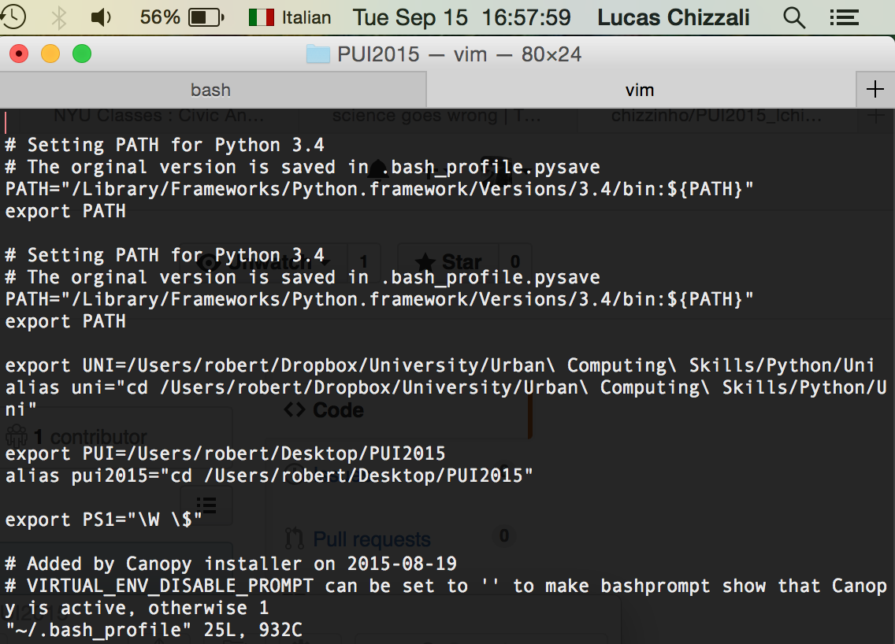

# PUI2015_lchizzali
I used ~/.bash_profile to export my environmental variables and to create aliases. This substitutes writing the whole path in the terminal each time accessing the folder. 
These are the terminal outputs

